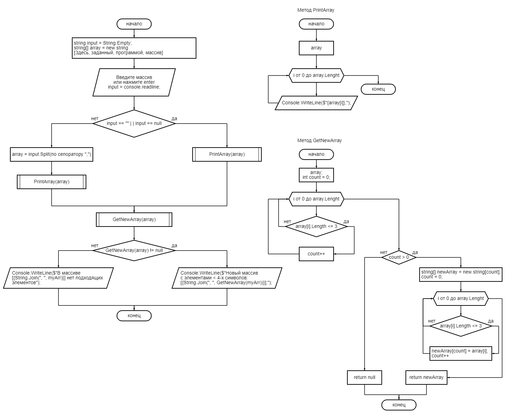

# Описание домашнего задания

**Описание задачи**

*Задача*: Написать программу, которая из имеющегося массива строк формирует новый массив из строк, длина которых меньше, либо равна 3 символам. Первоначальный массив можно ввести с клавиатуры, либо задать на старте выполнения алгоритма. При решении не рекомендуется пользоваться коллекциями, лучше обойтись исключительно массивами.

**Примеры решения**

[“Hello”, “2”, “world”, “:-)”] → [“2”, “:-)”]

[“1234”, “1567”, “-2”, “computer science”] → [“-2”]

[“Russia”, “Denmark”, “Kazan”] → []

# Описание решения задачи

1. Приветствуем пользователя. Сообщаем о том, что он может решить задачу с заданным массивом или создать свой массив.
2. Объявляем стринговую переменную __*input*__, в которую будем записывать ввод пользователя из консоли, а также инициализируем массив по умолчанию.
3. Предлагаем пользователю ввести массив, разбивая элементы через запятую "," или нажать __*Enter*__, тогда программа выполнится с установленным по умолчанию массивом.
4. Переменной __*input*__ присваимваем значение ввода с консоли. Если __*input*__ пуст или Null - пользователь нажал __*Enter*__, в противном случае пользователь что-то ввел с консоли.
5. Если пользователь выбрал массив по умолчанию, то мы сперва показываем содержимое массива с помощью метода *PrintArray*, а потом выполняем сам метод решения задачи - *GetNewArray*.
6. Если пользователь решил ввести массив самостоятельно, мы должны разбить строку на элементы массива через сепаратор ",". Сплитим строку и записываем все в массив.
7. Показываем, какой массив создал пользователь - *PrintArray*. Отрабатываем метод решения задачи - *GetNewArray*.
8. Метод *PrintArray* сделан через **void** без возвращения типа, он просто выводит в консоль элементы массива с новой строки.
9. Метод *GetNewArray* принимает строковый массив и возвращает другой строковый массив или **null**. Null будет в том случае, если во входящем массиве нет ни одного элемента, удовлетворяющего условию задачи - меньше четырех символов.
10. По условию задачи мы должны создать новый строковый масив из элементов входящего массива. Однако нам неизвестно, сколько элементов удовлетворяет условию, поэтому сперва через *for* пробегаемся по исходному массиву и смотрим сколько элементов удовлетворяет условию. Объявляем счетчик **count = 0**, и при каждом совпадении увеличиваем счетчик на единицу.
11. Если **count** остался равен 0, тогда метод вернет null.
12. Если **count** больше 0, тогда можем считать, что count - размерность нашего нового массива. Объявляем массив с размерностью count.
13. Пробегаемся по исходному массиву и все элементы, длина которых меньше или равна трем символам, записываем в новй массив.
14. Возвращаем получившийся массив.
15. Проверяем, как отработал метод *GetNewArray*: если вернул **null** - сообщаем пользователю, что в массиве нет подходящих элементов. Если метод вернул массив - показывааем пользователю новый массив со всеми элементами.

Ниже располагается блок-схема работы программы:
